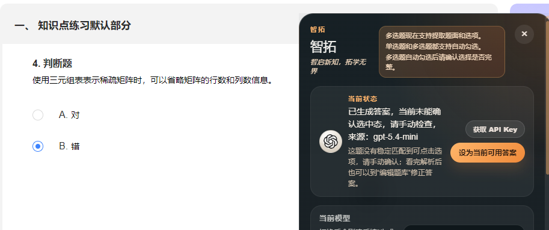
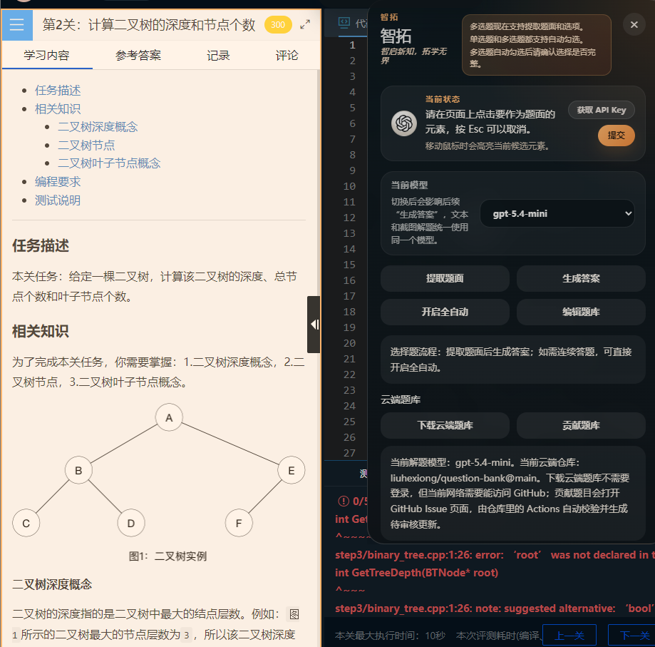
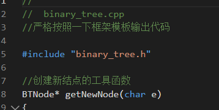
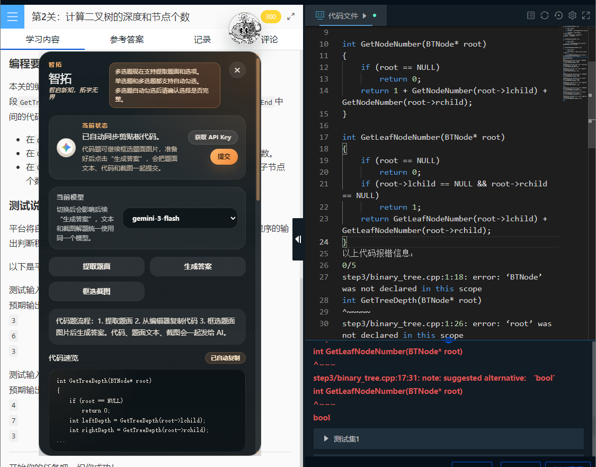

# 智拓

> 智启新知，拓学无界

智拓是一个浏览器扩展，面向智慧树、Educoder 这类做题页面，帮助你更快完成题面提取、答案生成、自动勾选.

[安装教程](#安装方式)

[使用方式](#推荐使用方式)

[题库使用指南](#题库使用须知)

## 安装方式

1. 打开 Chrome 或 Edge 的扩展管理页面

2. 开启“开发者模式”

3. 点击“加载已解压的扩展程序”

4. 选择项目下的 [`extension`](./extension) 目录 

## 推荐使用方式

# ***为了高效率使用使用前请将云端题库下载同步到本地使用***    [题库使用指南](#题库使用须知)

[回到顶部](#智拓)

### 打开插件主面板

#### 点击这个小球即可进入插件主面板，悬浮小球只有在适配的网站才会出现

### 配置API key

# ***API key是你AI 答题的凭证 没有API key无法正常使用ai答题功能***

#### 点击获取API key

#### 使用QQ邮箱或者Gmail邮箱注册，不支持临时邮箱，*避免反复注册*

### 选择题答题模式

#### 保持在 `选择题` 模式

#### 点击 `提取题面`

#### 如首次进入当前页面，按提示选取真正的题面区域并保存

##### 可在当前识别查看，识别的题目是否正确

##### 若以后需要在这个网站选取别的区域作为题面，可以点击更多操作展开,清除自定义题面规则

#### 点击 `生成答案`

***若没命中题库 则会显示这个画面 说明是新题 应该点击设为当前可用答案 如果最后解析出来做错了 请去编辑题库界面改正 然后贡献所有可以贡献的题目 获得API key奖励 去做代码题目  一次不要只贡献几道题目 多一点了再贡献***

***相信很快数据结构的题库就全部完善了***

#### 检查自动勾选结果

### 代码题答题模式

#### 切到 `代码题` 模式

#### 点击 `提取题面`

##### 如果右侧编辑器有代码，可以全选右侧编辑器内容，把代码复制到剪切板，插件会自动读取剪切板，并把题目和剪贴板的内容一起上传给AI解答

#### 点击 `生成答案`

##### 也可以在代码框内输入你想注入的提示词，作为注释输入，AI就能遵从

##### 如果AI回答错误，可以把报错信息粘贴到编辑器里面，然后再全选再复制到剪切板，把报错信息以及原代码模板一起上传给AI

***总而言之，你剪切板的内容会实时同步到这个提示词里面，题面是题面，你的剪贴板内容是剪贴板内容，截的图片这三个元素都会作为AI的提示词上传***

#### 查看并复制生成代码，手动回填到编辑器

[回到顶部](#智拓)

## 题库使用须知

# ***题库只支持选择题，代码题只支持AI答题***

***本地题库初始为空需要手动点击插件主面板的云端下载 需要能够连接github的网络环境***

# ***贡献前请到设置页面填写邮箱 对应api平台的邮箱 按照邮箱发放额度 -成功贡献题目获得更多 API-key的额度，即AI回答额度，大家多多贡献题库*****

# [回到使用方式](#推荐使用方式)

