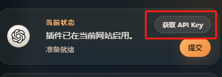
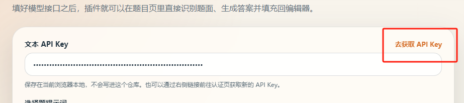
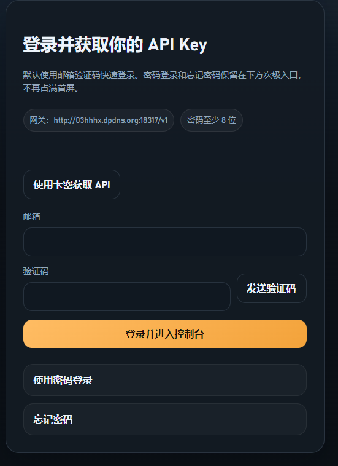
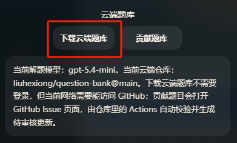

# 智拓

> 智启新知，拓学无界

智拓是一个浏览器扩展，面向智慧树、Educoder 这类做题页面，帮助你更快完成题面提取、答案生成、自动勾选.

[安装教程](#安装方式)

[使用方式](#推荐使用方式)

[题库使用指南](#题库使用须知)

[不足之处](#已知限制)

***AI答题目前暂时接入的是我自己搭建的API中转站 需要手动获取apikey 之后可能支持大家自定义API供应商***

## 当前支持

- 站点匹配：
  - `*.zhihuishu.com`
  - `educoder.net`
  - `*.educoder.net`
- 题型模式：
  - `选择题`
  - `代码题`

## 主要能力

 **截图搜题还在开发适配中** 

- 页面内悬浮助手面板
- 提取题目标题、题面正文、选项、样例、当前代码
- 支持自定义题面规则，按页面复用
- 支持局部截图、固定区域截图、可选 OCR
- 支持本地题库命中、编辑、导入、导出
- 支持从 GitHub 下载云端题库到本地缓存
- 支持适配网站的单选题和多选题自动勾选
- 支持适配网站自动点击“下一题”
-  ***目前只适配了智慧树的数据结构课程***。
- 支持全自动模式：
  - `文本识别-全自动答题`

## 模型切换

主面板顶部提供“当前模型”切换框，不需要进入设置页就可以切换当前解题模型。

- 当前固定支持模型：
  - `gemini-3-flash`
  - `claude-haiku-4-5-20251001`
  - `gpt-5.4-mini`
- 默认模型：
  - `gpt-5.4-mini`
- 模型切换会同时作用于：
  - 文本解题
  - 带截图的解题

## 安装方式

1. 打开 Chrome 或 Edge 的扩展管理页面

2. 开启“开发者模式”

3. 点击“加载已解压的扩展程序”

4. 选择项目下的 [`extension`](./extension) 目录 

   [回到顶部](#智拓)

## 基础配置

加载扩展后，可以从扩展选项页或主面板里的“设置”进入配置页。

若使用AI答题必须配置：

- 文本 API Key
- 当前解题模型

## 主面板使用

打开题目页后，右侧会出现悬浮按钮，展开后可以使用主面板。

常用入口：

- `提取题面`
- `生成答案`
- `编辑题库`
- `下载云端题库`
- `贡献题库`
- `框选截图`
- `设定区域`
- `开启全自动`
- `读取剪贴板代码`
- `设置`

当前面板还支持两组切换：

- `当前模型`
- `答题模式`
  - `选择题`
  - `代码题`
- `全自动模式`
  - `截图全自动`
  - `提取题面全自动`

## 题库能力

- 本地题库优先命中
- 支持导入、导出 JSON
- 支持在题库面板中直接修改答案并自动保存
- 支持下载 GitHub 云端题库到本地缓存参与匹配
- 支持从“我的题库”中勾选题目后发起贡献

## 推荐使用方式

# ***为了高效率使用使用前请将云端题库下载同步到本地使用***

[回到顶部](#智拓)

### 配置API key

#### 点击获取API key





#### 使用QQ邮箱或者Gmail邮箱注册，不支持临时邮箱，*避免反复注册*



### 选择题

1. 保持在 `选择题` 模式
2. 点击 `提取题面`
3. 如首次进入当前页面，按提示选取真正的题面区域并保存
4. 点击 `生成答案`
5. 检查自动勾选结果

### 代码题

1. 切到 `代码题` 模式
2. 点击 `提取题面`
3. 点击 `生成答案`
4. 查看并复制生成代码，手动回填到编辑器

### 多选题

- 多选题支持自动勾选
- 仍建议人工确认最终选中态
- 如页面同屏存在多题、预渲染题块或当前题定位不稳定，自动勾选可能点到错误题块，请务必复核

## 全自动模式

### 提取题面全自动

适合页面 DOM 能稳定提取题面与选项的场景。

流程：

1. 切到 `选择题`
2. 切到 `提取题面全自动`
3. 点击 `开启全自动`

### 截图全自动

适合 DOM 提取不稳定，但固定截图区域稳定的场景。

流程：

1. 切到 `选择题`
2. 切到 `截图全自动`
3. 先点击 `设定区域`
4. 点击 `开启全自动`

## 云端题库与后端

[回到顶部](#智拓)

当前推荐的日常路径是：

- 本地题库优先
- 云端题库存放在 GitHub JSON 中
- 扩展按需下载到本地缓存

如果你只是“下载云端题库到本地使用”，通常不需要启动本地后端。

本地后端主要用于：

- GitHub 登录
- 贡献流转
- 本地调试相关接口

启动命令：

```bash
npm run dev:server
```

## 本地检查

检查扩展脚本语法：

```bash
npm run check:extension
```

运行扩展冒烟测试：

```bash
npm run test:extension
```

## 项目结构

### 配置文件

| 文件 | 说明 |
|------|------|
| `package.json` | Node.js 项目定义、依赖、npm 脚本 |
| `package-lock.json` | 依赖锁文件（自动生成） |
| `.gitignore` | Git 忽略规则 |
| `.env.example` | 环境变量模板（旧 Playwright 原型） |
| `.env.local.example` | 环境变量模板（服务器用，**不要提交真实 Token**） |
| `.env.local` | 实际环境变量（已 gitignore，需自行创建） |

### 文档

| 文件 | 说明 |
|------|------|
| `README.md` | 项目说明与使用指南 |
| `CLAUDE.md` | Claude Code 开发指引 |

### 启动脚本

| 文件 | 说明 |
|------|------|
| `start-autolearning-server.bat` | Windows 启动后端（调用 ps1） |
| `start-autolearning-server.ps1` | PowerShell 启动后端（加载 .env、杀端口、启动服务） |

### 浏览器扩展 `extension/`

| 文件 | 说明 |
|------|------|
| `manifest.json` | Manifest V3 清单，定义权限、入口、资源 |
| `background.js` | 后台服务：设置存储、API 调用、流式响应、历史管理 |
| `content.js` | 内容脚本：注入悬浮面板、题面提取、答案回填、全自动流程 |
| `page-bridge.js` | 页面桥接：直接操作 Monaco/CodeMirror/Ace/textarea 编辑器 |
| `options.html` / `options.js` / `options.css` | 设置页：配置 API 端点、模型、快捷键、截图行为等 |
| `assets/` | 静态资源（模型 logo、加载动画等） |

### 后端服务 `server/`

| 文件 | 说明 |
|------|------|
| `index.js` | HTTP 服务器入口，处理路由 |
| `lib/github.js` | GitHub OAuth 登录、仓库同步、Issue 创建 |
| `lib/solver.js` | 解题接口封装 |
| `lib/db.js` | JSON 文件数据库读写 |
| `lib/utils.js` | 工具函数（哈希、时间等） |
| `data/db.json` | 本地数据存储 |

### 开发工具 `scripts/`

| 文件 | 说明 |
|------|------|
| `extension-smoke.mjs` | 扩展冒烟测试（模拟页面 + mock API，`npm run test:extension`） |
| `educoder-login-with-extension.mjs` | Educoder 平台登录测试 |
| `real-educoder-check.mjs` | 真实 Educoder 页面检查（需 macOS Chrome 配置） |
| `process-question-bank-contribution.mjs` | 处理题库贡献 PR（GitHub Actions 调用） |

### CI/CD `.github/workflows/`

| 文件 | 说明 |
|------|------|
| `process-question-bank-contribution.yml` | 自动处理题库贡献的 GitHub Actions 工作流 |


## 已知限制

- 这是学习辅助扩展，不保证所有站点结构都能稳定适配
- 自动勾选依赖当前题块定位；同页多题同时可见时，稳定性会下降
- 多选题虽然支持自动勾选，但仍建议手动确认
- 页面结构变化较大时，可能需要重新选择题面元素或补充站点适配

[回到顶部](#智拓)

## 题库使用须知

***本地题库初始为空需要手动从云端下载***



***每次成功贡献1道题目获得2点APIkey的额度即AI回答的能力*****

